# LLM API Integration: Direct vs MCP Server

## Executive Summary

**Direct API Calls**: Tightly coupled, developer-managed integration requiring hardcoded API knowledge in prompts.

**MCP Server**: Intelligent, standardized intermediary enabling dynamic tool discovery and autonomous agent behavior.

---

## Comparison Table for Google Slides

| **Aspect** | **Direct API Calls** | **MCP Server** |
|------------|---------------------|----------------|
| **Architecture** | LLM → Application Code → API | LLM → MCP Client → MCP Server → API |
| **Integration Type** | Deterministic, developer-managed | Dynamic, AI agent-driven |
| **API Knowledge** | Hardcoded in prompts & application code | Dynamically discovered at runtime |
| **Security Model** | Credentials exposed in LLM context | Credentials managed server-side |
| **Request Generation** | LLM generates HTTP requests (error-prone) | LLM selects predefined tools (deterministic) |
| **Data Format** | Raw API responses (manual transformation) | Structured, LLM-optimized responses |
| **Error Handling** | Developer-managed in code | Built into MCP server layer |
| **Pagination** | Manual implementation required | Abstracted by MCP server |
| **Flexibility** | Rigid - requires code changes for API updates | Flexible - adapts to tool catalog changes |
| **Latency** | Lower (direct path) | Slightly higher (additional abstraction layer) |
| **Autonomy** | Low - requires explicit instructions | High - LLM reasons about tool selection |
| **Best For** | Simple, high-performance data retrieval | Complex, multi-step workflows with reasoning |
| **Maintenance** | High - manual updates for API changes | Low - server handles API evolution |
| **Scalability** | Limited - scales linearly with integrations | High - centralized tool management |

---

## High-Level Comparison Infographic (Mermaid)

This diagram illustrates the architectural shift from rigid, direct coupling to dynamic, abstracted tool use.

```mermaid
graph TD
    subgraph "Approach A: Direct API Call (Rigid)"
        UserA[User Request] --> LLMA[LLM]
        LLMA -- "Hardcoded API Spec" --> AppCodeA[App Code]
        AppCodeA -- "HTTP Request (Raw)" --> APIA[Target API]
        APIA -- "Raw JSON Response" --> AppCodeA
        AppCodeA -- "Manual Processing" --> LLMA
        LLMA --> ResponseA[Final Answer]
    end

    subgraph "Approach B: MCP Server (Dynamic)"
        UserB[User Request] --> LLMB[LLM]
        LLMB -- "1. Discovery Query" --> MCPC[MCP Client]
        MCPC -- "2. Tool Catalog" --> LLMB
        LLMB -- "3. Select Tool(args)" --> MCPC
        MCPC -- "4. Secure Request" --> MCPS[MCP Server]
        MCPS -- "5. Managed API Call" --> APIB[Target API]
        APIB -- "6. Raw Data" --> MCPS
        MCPS -- "7. Structured/LLM-Ready Data" --> MCPC
        MCPC -- "8. Context-Rich Data" --> LLMB
        LLMB --> ResponseB[Final Answer]
    end

    style ApproachA fill:#fff1f0,stroke:#ff4d4f
    style ApproachB fill:#f6ffed,stroke:#52c41a
    style MCPS fill:#e6f7ff,stroke:#1890ff,stroke-width:2px
```

---

## Key Differentiators (Quick Reference)

### 🔴 Direct API Calls
- **Control**: Developer-driven
- **Setup**: Explicit coding required
- **Updates**: Manual code changes
- **Security**: ⚠️ Credentials in context
- **Performance**: ⚡ Fastest
- **Complexity**: Simple tasks only

### 🟢 MCP Server
- **Control**: AI agent-driven
- **Setup**: Tool catalog registration
- **Updates**: Dynamic discovery
- **Security**: 🔒 Server-side credential management
- **Performance**: Fast (with small overhead)
- **Complexity**: Handles multi-step workflows

---

## When to Use Each Approach

### Choose **Direct API Calls** when:
- ✅ Simple, single-endpoint data retrieval
- ✅ Maximum performance is critical
- ✅ API surface is small and stable
- ✅ No need for autonomous agent behavior
- ✅ Security isn't a primary concern (internal systems)

### Choose **MCP Server** when:
- ✅ Building autonomous AI agents
- ✅ Working with multiple, evolving APIs
- ✅ Security and credential isolation are critical
- ✅ Complex workflows requiring reasoning
- ✅ Need runtime tool discovery
- ✅ Want standardized integration patterns

---

## ROI Considerations

| **Factor** | **Direct API** | **MCP Server** |
|------------|----------------|----------------|
| Initial Setup Time | 1x | 2-3x |
| Maintenance Overhead | High | Low |
| Developer Burden | High (per integration) | Low (centralized) |
| Time to Add New API | Hours-Days | Minutes |
| Security Posture | Moderate | Strong |
| Agent Capabilities | Limited | Advanced |
